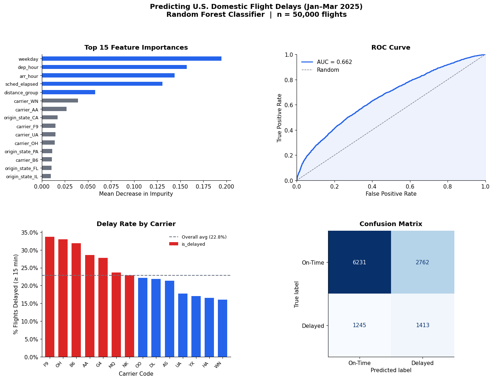
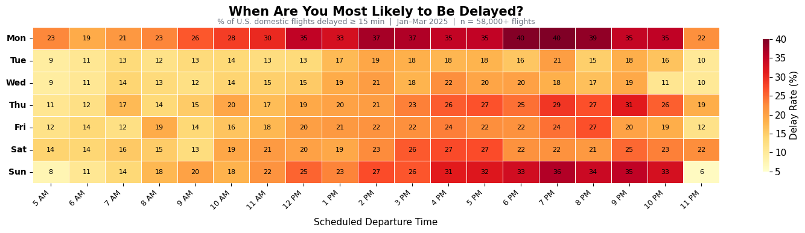

### Data Ingestion into MongoDB


```python
import csv
import pymongo
import random
from datetime import datetime
import os
from dotenv import load_dotenv
import glob
import logging
from pymongo import MongoClient
import pandas as pd

# Setup logging
logging.basicConfig(
    filename='../logs/pipeline.log',
    level=logging.INFO,
    format='%(asctime)s - %(levelname)s - %(message)s'
)
logger = logging.getLogger(__name__)
```

### Connecting to MongoDB and setting up the implicit schema


```python
load_dotenv()

MONGO_USER = os.getenv("MONGO_USER")
MONGO_PASS = os.getenv("MONGO_PASS")
MONGO_HOST = os.getenv("MONGO_HOST")

uri = f"mongodb+srv://{MONGO_USER}:{MONGO_PASS}@{MONGO_HOST}/?retryWrites=true&w=majority"
client = pymongo.MongoClient(uri)

db = client["flight_delays"]
collection = db["flights"]
```


```python

# --- Helper to safely convert to float ---
def to_float(val):
    try:
        return float(val)
    except (ValueError, TypeError):
        return None

def to_int(val):
    try:
        return int(float(val))
    except (ValueError, TypeError):
        return None

# Read ALL rows from all CSVs first
all_rows = []
csv_files = glob.glob("../data/*.csv")

for csv_file in csv_files:
    print(f"Reading {csv_file}...")
    with open(csv_file, "r", encoding="utf-8-sig") as f:
        reader = csv.DictReader(f)
        for row in reader:
            all_rows.append(row)

print(f"Total rows across all files: {len(all_rows)}")

# Randomly sample 50,000 rows to get a spread across all dates
SAMPLE_SIZE = 50000
if len(all_rows) > SAMPLE_SIZE:
    all_rows = random.sample(all_rows, SAMPLE_SIZE)
    print(f"Sampled down to {SAMPLE_SIZE} rows")

# Now transform and insert
docs = []
count = 0

for row in all_rows:
    doc = {
        "flight_date": {
            "date": row.get("FL_DATE", "").strip(),
            "weekday": row.get("DAY_OF_WEEK").strip()
        },
        "carrier": {
                "code": row.get("OP_CARRIER", "").strip(),
                "airline_id": to_int(row.get("OP_CARRIER_AIRLINE_ID")),
                "unique_carrier": row.get("OP_UNIQUE_CARRIER", "").strip()
            },
            "flight_number": to_int(row.get("OP_CARRIER_FL_NUM")),
            "origin": {
                "airport_id": to_int(row.get("ORIGIN_AIRPORT_ID")),
                "city": row.get("ORIGIN_CITY_NAME", "").strip(),
                "state": row.get("ORIGIN_STATE_ABR", "").strip()
            },
            "destination": {
                "airport_id": to_int(row.get("DEST_AIRPORT_ID")),
                "city_market_id": to_int(row.get("DEST_CITY_MARKET_ID"))
            },
            "schedule": {
                "crs_dep_time": row.get("CRS_DEP_TIME", "").strip(),
                "crs_arr_time": row.get("CRS_ARR_TIME", "").strip(),
                "crs_elapsed_time": to_float(row.get("CRS_ELAPSED_TIME"))
            },
            "actual": {
                "dep_time": row.get("DEP_TIME", "").strip(),
                "arr_time": row.get("ARR_TIME", "").strip(),
                "actual_elapsed_time": to_float(row.get("ACTUAL_ELAPSED_TIME")),
                "air_time": to_float(row.get("AIR_TIME")),
                "taxi_out": to_float(row.get("TAXI_OUT")),
                "taxi_in": to_float(row.get("TAXI_IN")),
                "wheels_off": row.get("WHEELS_OFF", "").strip(),
                "wheels_on": row.get("WHEELS_ON", "").strip()
            },
            "delay": {
                "dep_delay": to_float(row.get("DEP_DELAY")),
                "dep_delay_new": to_float(row.get("DEP_DELAY_NEW")),
                "dep_del15": to_float(row.get("DEP_DEL15")),
                "arr_delay": to_float(row.get("ARR_DELAY")),
                "arr_delay_new": to_float(row.get("ARR_DELAY_NEW")),
                "is_delayed": to_float(row.get("ARR_DELAY", 0)) is not None and (to_float(row.get("ARR_DELAY", 0)) or 0) >= 15,
                "carrier_delay": to_float(row.get("CARRIER_DELAY")),
                "weather_delay": to_float(row.get("WEATHER_DELAY")),
                "nas_delay": to_float(row.get("NAS_DELAY")),
                "security_delay": to_float(row.get("SECURITY_DELAY")),
                "late_aircraft_delay": to_float(row.get("LATE_AIRCRAFT_DELAY"))
            },
            "cancelled": to_float(row.get("CANCELLED")) == 1.0,
            "cancellation_code": row.get("CANCELLATION_CODE", "").strip() or None,
            "diverted": to_float(row.get("DIVERTED")) == 1.0,
            "distance_group": to_int(row.get("DISTANCE_GROUP"))
    }
    docs.append(doc)
    count += 1

    if len(docs) == 5000:
        collection.insert_many(docs)
        print(f"Inserted {count} documents...")
        docs = []

if docs:
    collection.insert_many(docs)

print(f"Done! {count} documents inserted.")
```

Now that this is properly uploaded to MongoDB we can pull it back in (and only use the features we want).


```python
import pandas as pd
import numpy as np
from datetime import datetime

# Project flight_date as a whole field (flat string in Atlas, not a nested object).
cursor = collection.find(
    {"cancelled": False},
    {
        "delay.is_delayed": 1,
        "carrier.code": 1,
        "flight_date": 1,
        "schedule.crs_dep_time": 1,
        "schedule.crs_arr_time": 1,
        "schedule.crs_elapsed_time": 1,
        "distance_group": 1,
        "origin.state": 1,
        "origin.airport_id": 1,
        "destination.airport_id": 1,
        "_id": 0
    }
)

def parse_weekday(flight_date_field):
    """Handle both flat string and nested-object storage of flight_date."""
    if isinstance(flight_date_field, dict):
        return int(flight_date_field.get("weekday", 0))
    if isinstance(flight_date_field, str) and flight_date_field:
        dt = datetime.strptime(flight_date_field, "%m/%d/%Y %I:%M:%S %p")
        return dt.isoweekday()  # 1=Mon ... 7=Sun, matches BTS DAY_OF_WEEK
    return None

def parse_hour(hhmm):
    """Extract hour from a HHMM string like '0659'."""
    s = (hhmm or "").strip()
    if len(s) >= 3:
        return int(s[:-2])
    return None

def parse_month(flight_date_field):
    """Extract calendar month (1-12) from the flight_date field."""
    if isinstance(flight_date_field, dict):
        date_str = flight_date_field.get("date", "")
    else:
        date_str = flight_date_field or ""
    if date_str:
        dt = datetime.strptime(date_str, "%m/%d/%Y %I:%M:%S %p")
        return dt.month
    return None

records = []
for doc in cursor:
    try:
        records.append({
            "is_delayed":     doc["delay"]["is_delayed"],
            "carrier":        doc["carrier"]["code"],
            "weekday":        parse_weekday(doc.get("flight_date")),
            "month":          parse_month(doc.get("flight_date")),
            "dep_hour":       parse_hour(doc["schedule"].get("crs_dep_time")),
            "arr_hour":       parse_hour(doc["schedule"].get("crs_arr_time")),
            "sched_elapsed":  doc["schedule"].get("crs_elapsed_time"),
            "distance_group": doc.get("distance_group"),
            "origin_state":   doc["origin"]["state"],
            "origin_airport": doc["origin"]["airport_id"],
            "dest_airport":   doc["destination"]["airport_id"],
        })
    except (KeyError, TypeError, ValueError) as e:
        logger.warning(f"Skipped malformed document: {e}")
        continue

df = pd.DataFrame(records)
df.dropna(inplace=True)
df["is_delayed"] = df["is_delayed"].astype(int)

logger.info(f"Loaded {len(df)} flight records from MongoDB for modeling")
print(f"Loaded {len(df):,} records  |  Delayed: {df['is_delayed'].mean():.1%}")
df.head(3)

```

    Loaded 58,253 records  |  Delayed: 22.8%


<div>
<style scoped>
    .dataframe tbody tr th:only-of-type {
        vertical-align: middle;
    }

    .dataframe tbody tr th {
        vertical-align: top;
    }

    .dataframe thead th {
        text-align: right;
    }
</style>
<table border="1" class="dataframe">
  <thead>
    <tr style="text-align: right;">
      <th></th>
      <th>is_delayed</th>
      <th>carrier</th>
      <th>weekday</th>
      <th>month</th>
      <th>dep_hour</th>
      <th>arr_hour</th>
      <th>sched_elapsed</th>
      <th>distance_group</th>
      <th>origin_state</th>
      <th>origin_airport</th>
      <th>dest_airport</th>
    </tr>
  </thead>
  <tbody>
    <tr>
      <th>0</th>
      <td>0</td>
      <td>AA</td>
      <td>1</td>
      <td>1</td>
      <td>6</td>
      <td>10</td>
      <td>381.0</td>
      <td>10</td>
      <td>NY</td>
      <td>12478</td>
      <td>12892</td>
    </tr>
    <tr>
      <th>1</th>
      <td>0</td>
      <td>AA</td>
      <td>1</td>
      <td>1</td>
      <td>22</td>
      <td>6</td>
      <td>292.0</td>
      <td>9</td>
      <td>NV</td>
      <td>12889</td>
      <td>12478</td>
    </tr>
    <tr>
      <th>2</th>
      <td>0</td>
      <td>AA</td>
      <td>1</td>
      <td>1</td>
      <td>6</td>
      <td>10</td>
      <td>141.0</td>
      <td>3</td>
      <td>WI</td>
      <td>13485</td>
      <td>11057</td>
    </tr>
  </tbody>
</table>
</div>


### Feature Engineering

We one-hot encode categorical variables (`carrier`, `origin_state`) so that
the Random Forest can consume them without imposing an arbitrary ordinal ordering.


```python
from sklearn.model_selection import train_test_split


VIZ_COLS  = ["origin_airport", "dest_airport", "month"]
MODEL_COLS = [c for c in df.columns if c not in VIZ_COLS]
df_model   = df[MODEL_COLS].copy()

df_encoded = pd.get_dummies(df_model, columns=["carrier", "origin_state"], drop_first=False)

X = df_encoded.drop(columns=["is_delayed"])
y = df_encoded["is_delayed"]

X_train, X_test, y_train, y_test = train_test_split(
    X, y, test_size=0.20, random_state=42, stratify=y
)

print(f"Train: {len(X_train):,} rows  |  Test: {len(X_test):,} rows")
print(f"Features: {X_train.shape[1]}")

```

    Train: 46,602 rows  |  Test: 11,651 rows
    Features: 71


### Model: Random Forest Classifier


```python
from sklearn.ensemble import RandomForestClassifier
from sklearn.metrics import (
    classification_report, roc_auc_score, confusion_matrix, ConfusionMatrixDisplay
)

rf = RandomForestClassifier(
    n_estimators=200,
    max_depth=12,
    class_weight="balanced",
    random_state=42,
    n_jobs=-1
)

rf.fit(X_train, y_train)
logger.info("Random Forest model trained")

y_pred  = rf.predict(X_test)
y_prob  = rf.predict_proba(X_test)[:, 1]
auc     = roc_auc_score(y_test, y_prob)

print(classification_report(y_test, y_pred, target_names=["On-Time", "Delayed"]))
print(f"ROC-AUC: {auc:.4f}")
logger.info(f"ROC-AUC: {auc:.4f}")

```

                  precision    recall  f1-score   support
    
         On-Time       0.83      0.69      0.76      8993
         Delayed       0.34      0.53      0.41      2658
    
        accuracy                           0.66     11651
       macro avg       0.59      0.61      0.59     11651
    weighted avg       0.72      0.66      0.68     11651
    
    ROC-AUC: 0.6618


Suprising, 66% ROC-AUC, I expected this to be a bit higher but then again so many external factors play into delays, so im not very surprised.

### Visualization


```python
import matplotlib
import matplotlib.pyplot as plt
import matplotlib.gridspec as gridspec
from sklearn.metrics import roc_curve

matplotlib.rcParams.update({
    "font.family":  "DejaVu Sans",
    "font.size":    11,
    "axes.spines.top":   False,
    "axes.spines.right": False,
})

ACCENT  = "#2563EB"   # blue
WARN    = "#DC2626"   # red
NEUTRAL = "#6B7280"   # grey

fig = plt.figure(figsize=(16, 11))
gs  = gridspec.GridSpec(2, 2, figure=fig, hspace=0.40, wspace=0.35)

# feature importance
ax1 = fig.add_subplot(gs[0, 0])

importances = pd.Series(rf.feature_importances_, index=X_train.columns)
top15 = importances.nlargest(15).sort_values()

colors = [ACCENT if "carrier" not in i and "origin" not in i else NEUTRAL for i in top15.index]
top15.plot(kind="barh", ax=ax1, color=colors, edgecolor="none")
ax1.set_title("Top 15 Feature Importances", fontweight="bold", pad=10)
ax1.set_xlabel("Mean Decrease in Impurity")
ax1.tick_params(axis="y", labelsize=9)
ax1.axvline(0, color="black", linewidth=0.8)

# ROC curve
ax2 = fig.add_subplot(gs[0, 1])

fpr, tpr, _ = roc_curve(y_test, y_prob)
ax2.plot(fpr, tpr, color=ACCENT, lw=2, label=f"AUC = {auc:.3f}")
ax2.plot([0, 1], [0, 1], color=NEUTRAL, lw=1, linestyle="--", label="Random")
ax2.fill_between(fpr, tpr, alpha=0.08, color=ACCENT)
ax2.set_xlabel("False Positive Rate")
ax2.set_ylabel("True Positive Rate")
ax2.set_title("ROC Curve", fontweight="bold", pad=10)
ax2.legend(frameon=False)
ax2.set_xlim(0, 1); ax2.set_ylim(0, 1)

# delay rate by carrier
ax3 = fig.add_subplot(gs[1, 0])

carrier_delay = (
    df.groupby("carrier")["is_delayed"]
    .mean()
    .sort_values(ascending=False)
)
bar_colors = [WARN if v > df["is_delayed"].mean() else ACCENT for v in carrier_delay]
carrier_delay.plot(kind="bar", ax=ax3, color=bar_colors, edgecolor="none", width=0.7)
ax3.axhline(df["is_delayed"].mean(), color=NEUTRAL, lw=1.5,
            linestyle="--", label=f"Overall avg ({df['is_delayed'].mean():.1%})")
ax3.yaxis.set_major_formatter(matplotlib.ticker.PercentFormatter(xmax=1))
ax3.set_title("Delay Rate by Carrier", fontweight="bold", pad=10)
ax3.set_xlabel("Carrier Code")
ax3.set_ylabel("% Flights Delayed (≥ 15 min)")
ax3.set_xticklabels(carrier_delay.index, rotation=45, ha="right", fontsize=9)
ax3.legend(frameon=False, fontsize=9)

# confusion matrix
ax4 = fig.add_subplot(gs[1, 1])

cm = confusion_matrix(y_test, y_pred)
disp = ConfusionMatrixDisplay(confusion_matrix=cm, display_labels=["On-Time", "Delayed"])
disp.plot(ax=ax4, colorbar=False, cmap="Blues")
ax4.set_title("Confusion Matrix", fontweight="bold", pad=10)

fig.suptitle(
    "Predicting U.S. Domestic Flight Delays (Jan–Mar 2025)\n"
    "Random Forest Classifier  |  n = 50,000 flights",
    fontsize=14, fontweight="bold", y=1.01
)

plt.savefig("../figures/delay_model_results.png", dpi=200,
            bbox_inches="tight", facecolor="white")
logger.info("Saved figures/delay_model_results.png")
plt.show()
print("Figure saved to figures/delay_model_results.png")

```


    

    


    Figure saved to figures/delay_model_results.png


### Visualization Rationale

| Panel | Chart type | Why chosen |
|-------|-----------|------------|
| Feature Importance | Horizontal bar | Ordered importance values are most readable as horizontal bars; color distinguishes continuous vs. categorical-derived features |
| ROC Curve | Line + fill | Standard for binary classifiers; AUC summarises performance across all decision thresholds |
| Delay Rate by Carrier | Vertical bar | Aggregated proportions across 14 carriers; red/blue coloring immediately flags above/below-average performers |
| Confusion Matrix | Heatmap | Exposes the asymmetry between false positives and false negatives, critical for operational decision-making |

All panels share a consistent two-color palette (blue = neutral/good, red = alert) and
remove chart-junk spines to meet publication standards.

### Press Release Visualization: Best and Worst Times to Fly

This heatmap is designed for a general audience, it answers the traveler's question
directly: "When should I book to minimize my chance of a delay?"


```python
import seaborn as sns

DAY_LABELS = {1: "Mon", 2: "Tue", 3: "Wed", 4: "Thu", 5: "Fri", 6: "Sat", 7: "Sun"}

# Only include hours that have at least 100 flights 
valid_hours = (
    df.groupby("dep_hour")["is_delayed"]
    .count()
    .pipe(lambda s: s[s >= 100].index)
)

pivot = (
    df[df["dep_hour"].isin(valid_hours)]
    .groupby(["weekday", "dep_hour"])["is_delayed"]
    .mean()
    .unstack("dep_hour")
    .mul(100)  # percentage
)
pivot.index = [DAY_LABELS[d] for d in pivot.index]

def hour_label(h):
    """Convert 24-hour int to readable AM/PM string."""
    if h == 0:  return "12 AM"
    if h < 12:  return f"{h} AM"
    if h == 12: return "12 PM"
    return f"{h - 12} PM"

col_labels = [hour_label(h) for h in pivot.columns]

fig, ax = plt.subplots(figsize=(15, 4))

sns.heatmap(
    pivot,
    ax=ax,
    cmap="YlOrRd",
    linewidths=0.4,
    linecolor="white",
    annot=True,
    fmt=".0f",
    annot_kws={"size": 8, "color": "black"},
    cbar_kws={"label": "Delay Rate (%)", "shrink": 0.85},
    vmin=5,
    vmax=40,
)

ax.set_xticklabels(col_labels, rotation=45, ha="right", fontsize=9)
ax.set_yticklabels(ax.get_yticklabels(), rotation=0, fontsize=10, fontweight="bold")
ax.set_xlabel("Scheduled Departure Time", fontsize=11, labelpad=8)
ax.set_ylabel("")

ax.set_title(
    "When Are You Most Likely to Be Delayed?",
    fontsize=15, fontweight="bold", pad=14
)
fig.text(
    0.5, 1.01,
    "% of U.S. domestic flights delayed ≥ 15 min  |  Jan–Mar 2025  |  n = 58,000+ flights",
    ha="center", va="bottom", fontsize=9, color="#6B7280",
    transform=ax.transAxes
)

plt.tight_layout()
plt.savefig("../figures/best_times_to_fly.png", dpi=200,
            bbox_inches="tight", facecolor="white")
logger.info("Saved figures/best_times_to_fly.png")
plt.show()
print("Saved → figures/best_times_to_fly.png")

```


    

    


    Saved → figures/best_times_to_fly.png

