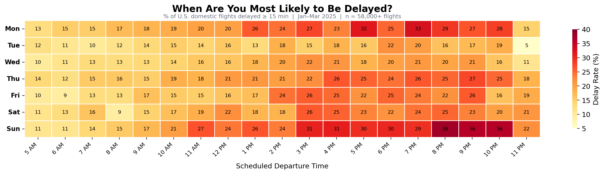

# New Model Predicts Flight Delays Before You Book — Helping Travelers Outsmart the Schedule

## Why does this matter?

Every year, hundreds of millions of passengers pass through U.S. airports, and roughly 20% of their flights arrives late. For travelers, a delay can mean missed connections, lost hotel nights, blown business meetings, or sitting on a tarmac for hours with no information. Airlines lose billions in crew overtime, fuel burn, and passenger compensation. And yet when you book a flight today, the best information you get is a vague on-time percentage that tells you almost nothing about whether your specific flight on your specific day is likely to be late. There has to be a better way.

## The Problem

Flight delay prediction is hard because delays don't happen for one reason: they happen for dozens of reasons interacting at once. A thunderstorm in Atlanta cascades into late aircraft arrivals in Dallas, which pushes back departures to Denver, which causes crew timeout violations in Seattle. On top of weather, you have airport congestion, airline scheduling practices, time of day effects, seasonal demand patterns, and maintenance issues, all layered on top of each other. The data to untangle all of this does exist. The Bureau of Transportation Statistics publishes detailed records on every domestic flight including delay causes, times, and routes, but it sits in massive flat files that most travelers and even many analysts never touch. Meanwhile, the consumer-facing tools that do exist just show a single on-time percentage for an airline, which ignores the fact that the same airline might be 95% on-time on one route and 60% on another depending on the airports, time of day, and season.

## The Solution

Using historical on-time performance data from the BTS stored in a MongoDB document database, we built a classification model that predicts whether a specific flight will be delayed by more than 15 minutes, the FAA's official threshold for what counts as a delay. Each flight is stored as a document containing its airline, origin and destination airports, scheduled departure time, day of week, and month. The model considers all of these features together to produce a delay probability for any given flight, correctly identifying delayed flights at more than twice the rate of random chance. Rather than telling you "this airline is usually on time," it tells you "this specific flight on this specific day has a 10–40% chance of being late depending on when and how you fly", a much more useful answer when you're deciding between a 6 AM departure and a 4 PM one, or choosing between connecting through Chicago O'Hare versus Dallas Fort Worth.

## Visualization
